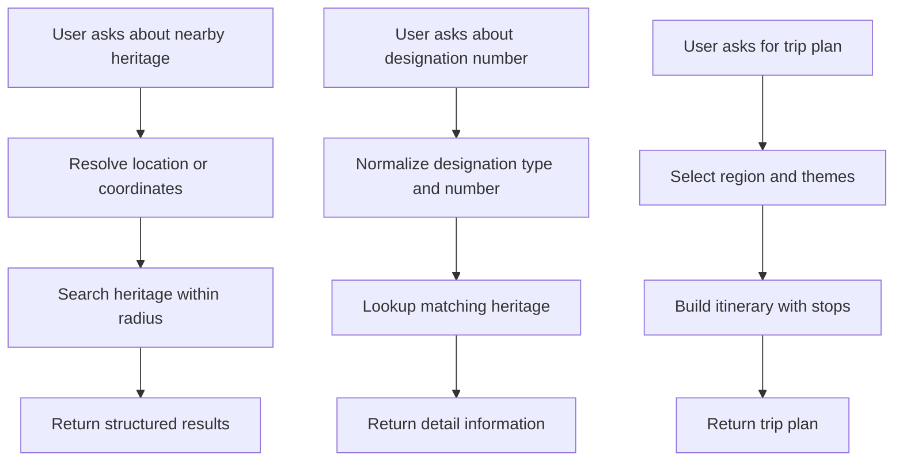

# User Flow

```mermaid
flowchart TD
  A[User asks about nearby heritage] --> B[Resolve location or coordinates]
  B --> C[Search heritage within radius]
  C --> D[Return structured results]

  E[User asks about designation number] --> F[Normalize designation type and number]
  F --> G[Lookup matching heritage]
  G --> H[Return detail information]

  I[User asks for trip plan] --> J[Select region and themes]
  J --> K[Build itinerary with stops]
  K --> L[Return trip plan]
```
